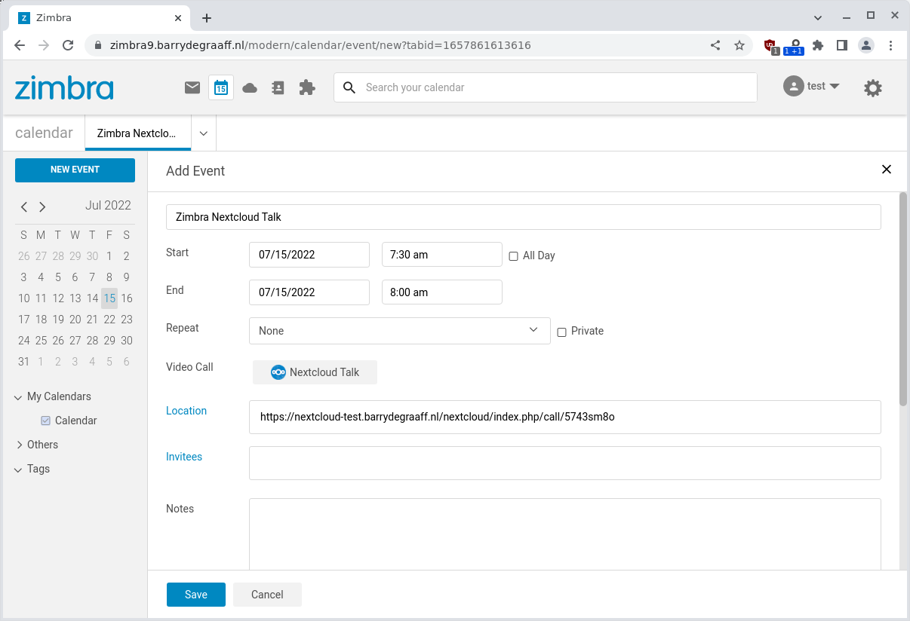
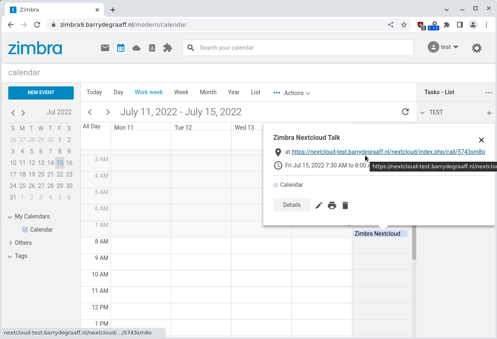
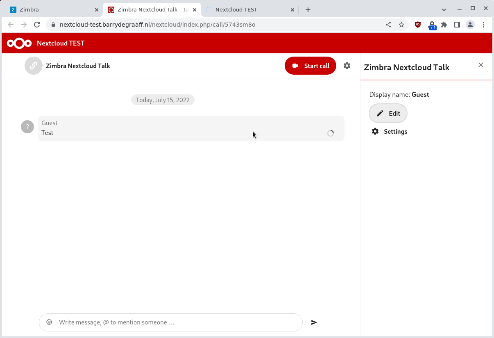

# Nextcloud Talk Zimlet

This Zimlet add a button in the new appointment window that allows you to create a Nextcloud Talk meeting from the Zimbra Calendar.

## Screenshots





## Installing

This Zimlet depends on the installation of Nextcloud Zimlet for Zimbra. Please install it via the instructions in https://github.com/Zimbra/zimbra-zimlet-nextcloud and https://zimbra.github.io/zimbra-9/adminguide.html#_setting_up_nextcloud.

The back-end for Zimbra Talk is not yet released, so you need to update it manually after the installation steps above by running:

```
wget https://github.com/Zimbra/zm-nextcloud-extension/releases/download/9.0.0.p26/zm-nextcloud-extension.jar -O /opt/zimbra/lib/ext/nextcloud/zm-nextcloud-extension.jar
su zimbra -
zmmailboxdctl restart
```